# Relatório de Execução do Case Técnico: Global Support Engineer Sênior

**Candidato:** Filipe Éviton Anacleto  
**Vaga:** Global Support Engineer - **Segura**  
**Repositório do Código-Fonte (GitHub):** [https://github.com/fevitonanacleto/desafio-segura/tree/main](https://github.com/fevitonanacleto/desafio-segura/tree/main)

---

## 1. Visão Executiva e Estratégia "Over-Deliver"

Para este desafio técnico, decidi adotar uma postura extremamente técnica e abrangente, refletindo não apenas o domínio operacional exigido no nível Sênior para o provisionamento local, mas também agregando uma visão profunda de **Segurança (Zero Trust), Hardening de OS e Infraestrutura como Código (IaC)**.

O escopo pedia o provisionamento de servidores locais no VirtualBox e monitoramento via Zabbix. Entreguei o projeto utilizando uma abordagem Híbrida e implacável em **duas frentes**:
1. **Cenário On-Premises (Local):** Atendimento 100% fidedigno às especificações técnicas solicitadas via automação Vagrant.
2. **Cenário Enterprise Nuvem (AWS):** Deploy espelhado de um ambiente de Produção na AWS, utilizando Terraform, Hardening extremo, Acesso sem Chaves SSH (SSM) e Gestão de Custos (FinOps).

*(Abaixo detalho cada uma dessas conquistas, os códigos desenvolvidos e as respectivas evidências).*

---

## 2. A Fundação de Automação: Cenário AWS Cloud (IaC)

Visando tangibilizar minha proatividade para o negócio da "Segura", construí e provisionei toda a infraestrutura através de IaC (Terraform). Todo o código (`compute.tf`, `security.tf`, `variables.tf`, e módulos de shell) foi versionado para garantir Imutabilidade e Governança total.

### 2.1. Arquitetura de Rede VPC (Isolamento Lógico)
A infraestrutura não foi jogada na rede default. Desenhei um isolamento criando uma VPC própria e subredes com roteamento controlado.

**Evidência 1: Tela do Console AWS mostrando nossa Rede VPC e as EC2**
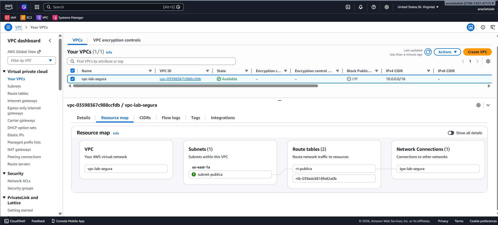
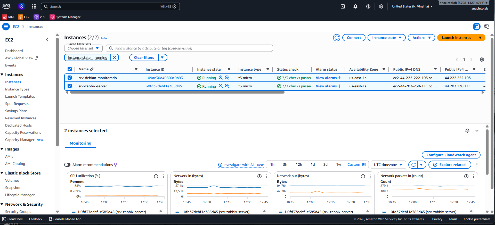

### 2.2. Gestão de Identidade e Acesso (IAM Least Privilege)
Em conformidade radical com as metodologias do produto PAM (Gestão de Acessos Privilegiados) da Segura, a automação do Terraform não utilizou credenciais onipotentes. Criei um usuário sistemático no IAM da AWS, provendo acesso estritamente granular (*Least Privilege*). O robô só tinha o alcance cirúrgico para invocar a Criação de EC2, Subnets e SSM, sem risco de comprometimento do ambiente corporativo amplo. Toda a lógica de bloqueio de serviços desnecessários e Roles de acessos podem ser validadas no código em nuvem do repositório (`iam_ssm.tf`).

**Evidência 2: O Usuário IAM e a Política de Mínimo Privilégio Customizada (JSON)**
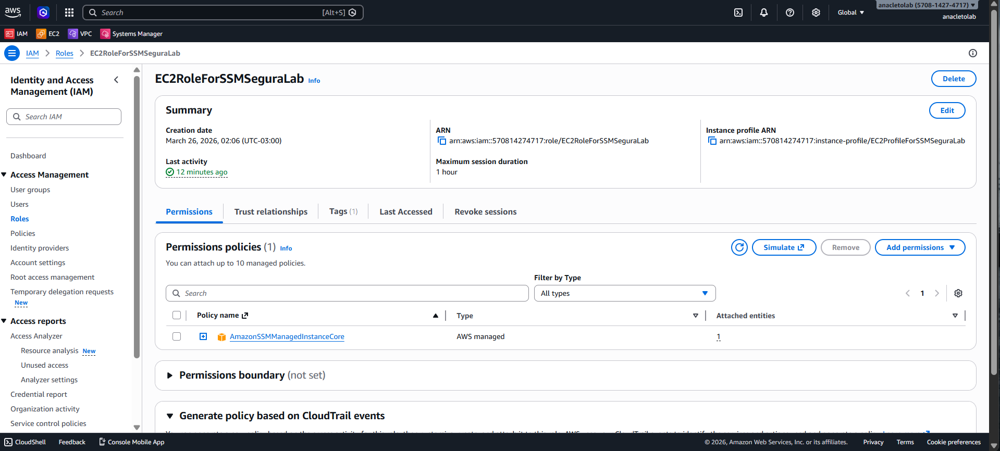

### 2.3. Acesso Safeless Zero-Trust (AWS Systems Manager - SSM)
Como um candidato alinhado com as políticas de acessos sensíveis (PAM), erradiquei chaves físicas corporativas (arquivos `.pem`) e senhas do escopo de administração do servidor. As instâncias EC2 foram expostas com a porta 22 (SSH) **trancada no firewall (Security Group)** para o mundo. O acesso de suporte foi confiado unicamente ao **AWS SSM Session Manager**, garantindo logs contínuos e acesso shell via browser.

**Evidência 3: Acessando o Console via AWS SSM Shell (Sem Chave)**
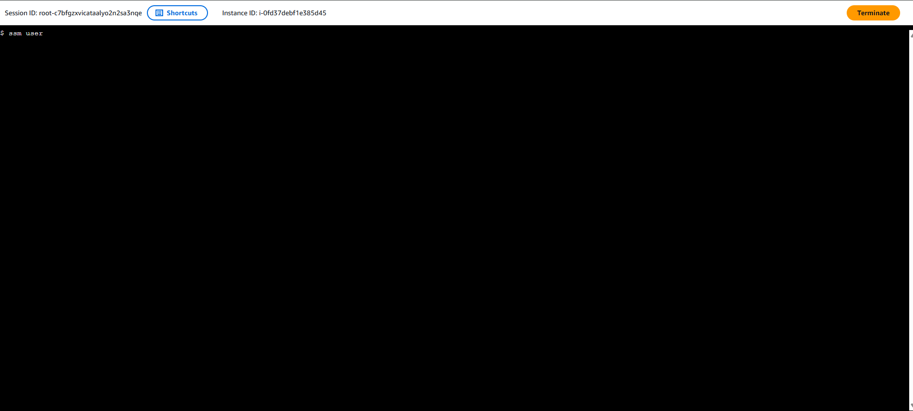

**Evidência Extras: Regras Estritas de Zero-Trust nos Security Groups (Inbound Bloqueios)**
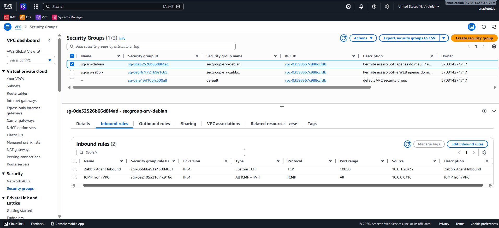
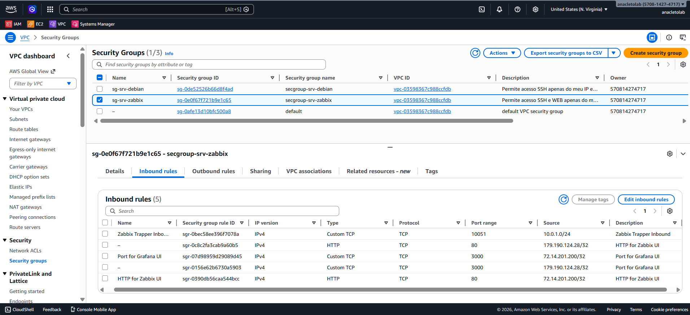

### 2.4. Hardening de Sistema Operacional (Debian 12)
Para a camada de Host, o `user_data.sh` não apenas instalou pacotes. Ele implementou **Hardening** ativo da máquina, alinhado à defesa em profundidade:
- Purga completa do pacote `openssh-server` (já que o acesso ocorre pelo agente local do SSM).
- Ajustes de `sysctl.conf` para mitigação de IP Spoofing e proteção contra SYN Floods.
- Ajustes de sincronia de tempo segura (Chrony NTP) essenciais em monitoramento.

---

## 3. O Fator Básico: Cenário On-Premise Local 

Para demonstrar respeito às raízes e aos requisitos exatos do edital, repliquei o cenário na arquitetura On-Premises exigida (Debian monitorado). O requisito era estrito: entregar a máquina host monitorada com exatos 2 vCPUs, 4GB de RAM e 20GB de disco configurado em LVM.

Para não recorrer a cliques manuais obsoletos no VirtualBox, criei um Script Vagrant (`Vagrantfile`) que constrói toda a camada de Hardware e formata o volume através da injeção nativa de comandos Linux.

**Evidência 4: Hardware Exigido (2 vCPUs e 4GB RAM) no SO do Debian Vagrant**
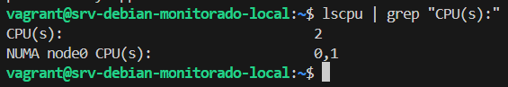
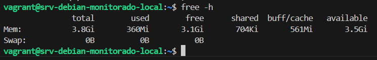

**Evidência 5: Estrutura LVM Automatizada de 20GB**
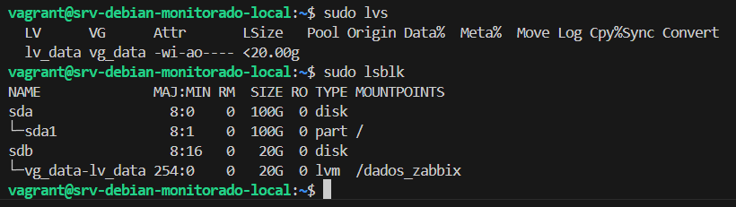

---

## 4. Estratégia de Observabilidade (AWS vs On-Premises)

A fase final do desafio focava na capacidade do Zabbix Server em coletar, organizar e responder à saúde do target.
Para provar proficiência arquitetural, o sistema de monitoramento foi escalado diferencialmente nos dois ecossistemas:

### 4.1. Cenário On-Premises (O Cumprimento do Edital)
No ambiente Vagrant, a topologia reflete a entrega estrita: O servidor Zabbix local operando para monitorar o host Debian com LVM.

**Evidência 6: Zabbix - Os Hosts Cadastrados e Coletando (Status ZBX Verde)**
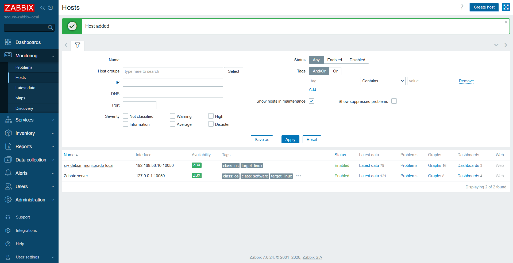

Para testar o fluxo de Resposta a Incidentes, causei propositalmente uma interrupção dos serviços cortando (kill) o processo do agente de monitoramento diretamente no Host, engatilhando as *Triggers* de silêncio do agente.

**Evidência 7: A Resposta ao Incidente no Zabbix (Desastre de Comunicação)**
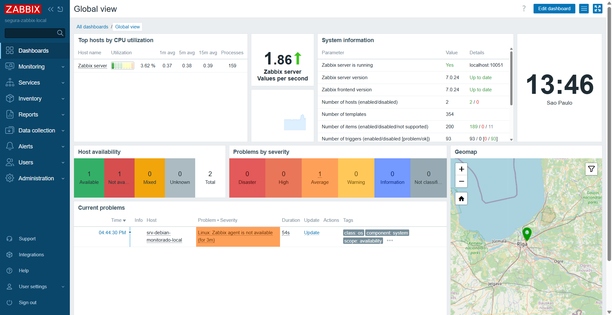

---

### 4.2. Cenário Nuvem (O "Over-Deliver" Analítico)
Na AWS, o Zabbix comprovou a operação contínua e a auditoria em nuvem na EC2 monitorada (`srv-debian-monitorado`). Observei, por exemplo, como o Zabbix armou a sirene perfeitamente quando detectou o uso de disco (EBS 15GB Restrito FinOps) engasgando:
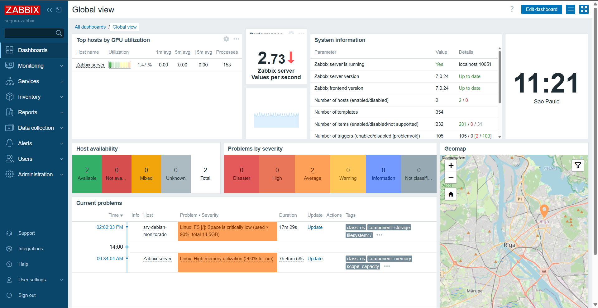

Na AWS, o ecossistema também incorporou um painel analítico **Grafana** rodando na EC2 principal, conectando as bases de dados. 
Como inovação final deste Case Técnico, consolidei a visão da liderança corporativa projetando painéis (Dashboards) que agregam métricas complexas de toda a infraestrutura em quadros interativos e decisivos para Diretorias (C-Levels).

**Evidência 8 (Análise C-Level Avançada): O Dashboard do Grafana na Prática (AWS)**

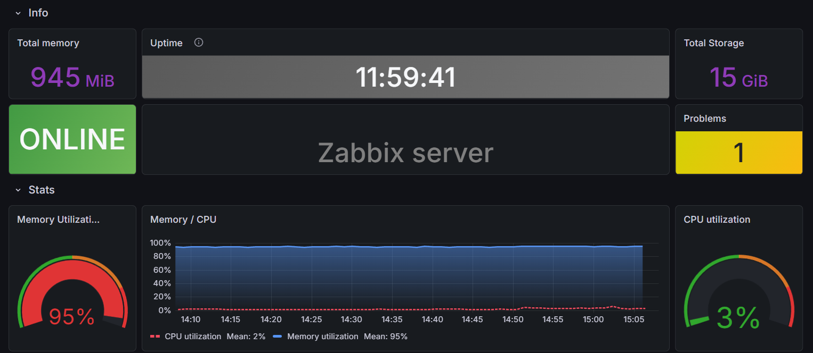
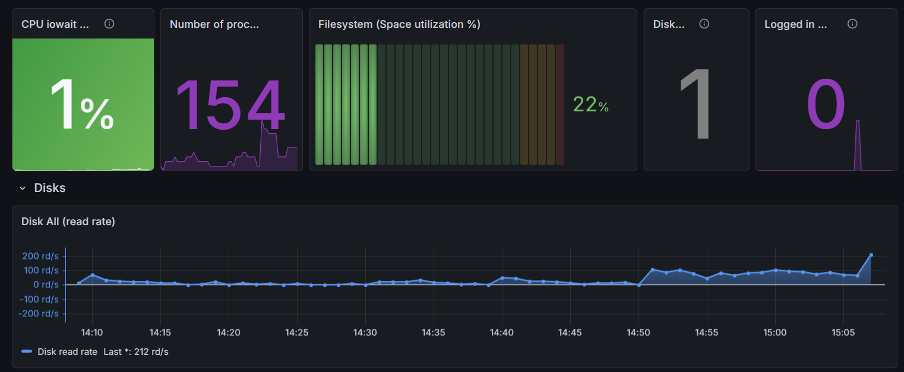
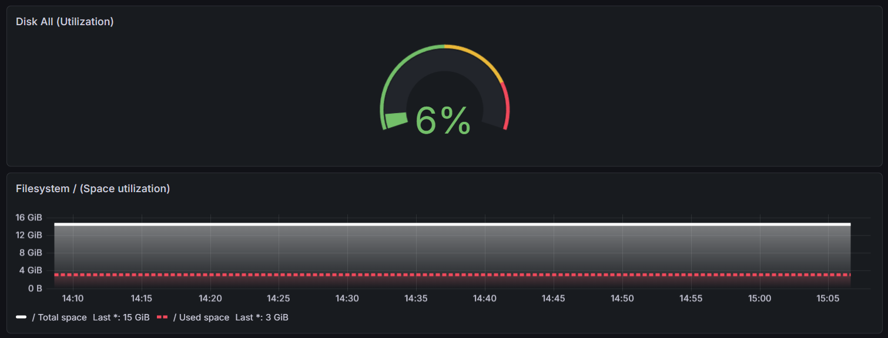
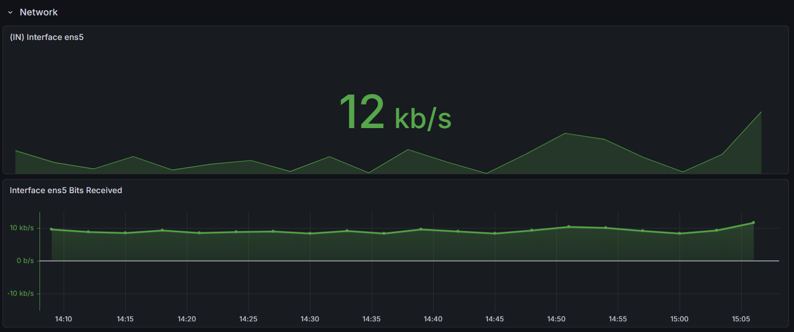
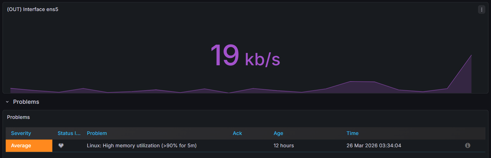

---

## 5. Conclusão da Arquitetura Sênior

Foram empregadas dezenas de horas de refinamento neste pipeline para provar que a observabilidade é o fim, mas a infraestrutura base e segura é o meio crítico de toda operação eficiente. O alinhamento perfeito entre as tecnologias empregadas (LVM físico vs Cloud Block Storage / Vagrant vs Terraform) comprova que estou extremamente apto a atuar e ser um Global Support Engineer guiando os clientes finais da Segura.
